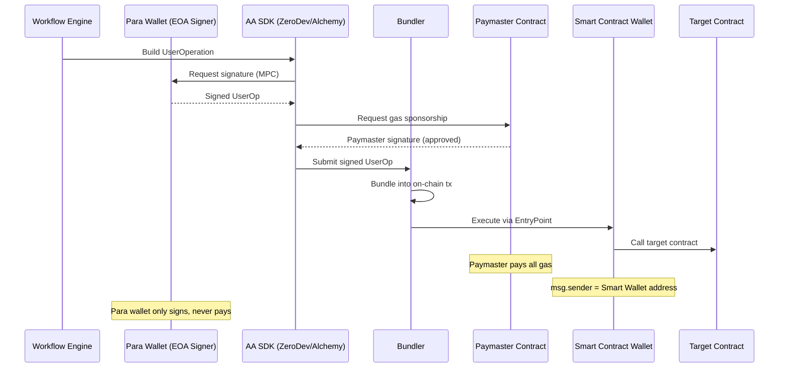
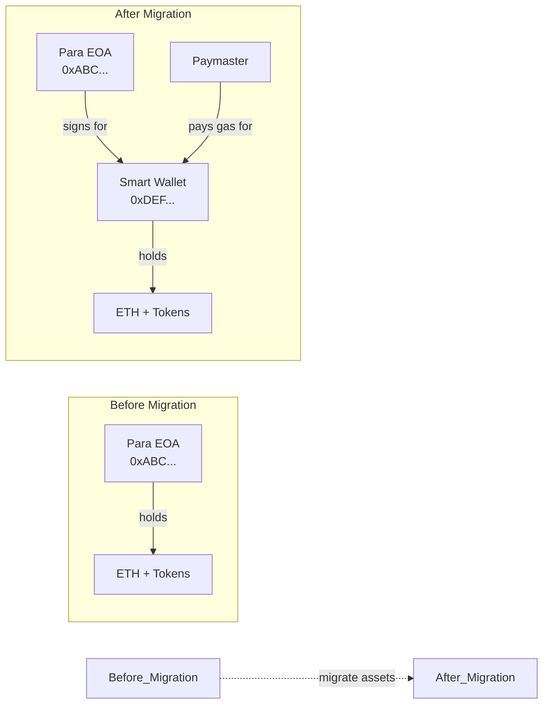
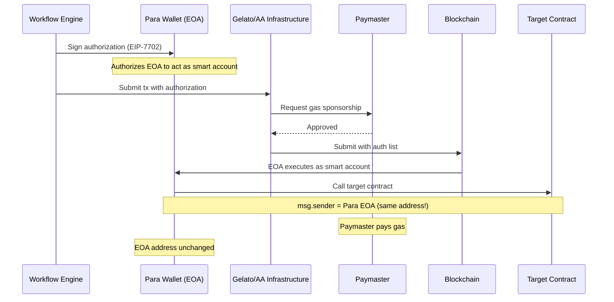
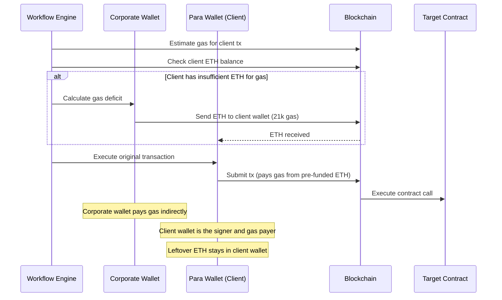
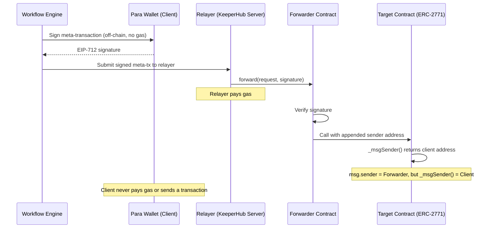

# Gas Sponsorship Solutions - Technical Specification

## Problem Statement

Clients currently pay for gas twice:
1. **Credits**: KeeperHub's billing system charges credits for gas as part of workflow execution cost
2. **ETH**: The client's Para wallet must hold ETH to pay actual on-chain gas when executing transactions

**Goal**: Eliminate requirement #2 - clients should never need ETH in their Para wallet for gas. KeeperHub pays for on-chain gas.

**Critical constraint**: All client assets must remain on their wallets/addresses. Clients own and control their assets.

## Current Architecture

```
Client Para Wallet (EOA) ──signs──> Transaction ──pays gas──> Blockchain
                          ──owns assets──> ERC-20 tokens, ETH
```

Three transaction types in workflow steps:
- **write-contract**: Calls smart contract functions (no value sent)
- **transfer-token**: ERC-20 token transfers (tokens from client wallet)
- **transfer-funds**: Native ETH transfers (ETH from client wallet)

Key files:
- `keeperhub/plugins/web3/steps/write-contract.ts`
- `keeperhub/plugins/web3/steps/transfer-funds.ts`
- `keeperhub/plugins/web3/steps/transfer-token.ts`
- `keeperhub/lib/para/wallet-helpers.ts` (ParaEthersSigner initialization)
- `keeperhub/lib/web3/nonce-manager.ts` (distributed nonce management)
- `keeperhub/lib/web3/transaction-manager.ts` (withNonceSession wrapper)
- `keeperhub/api/user/wallet/withdraw/route.ts` (manual withdrawals)

---

## Option 1: ERC-4337 Account Abstraction with Paymaster

### How It Works

Each organization gets a **smart contract wallet** (e.g., Kernel, Modular Account) controlled by their Para wallet. A **paymaster** contract pays gas on behalf of the user. Transactions are submitted as **UserOperations** through a bundler.



### Wallet Address Impact

- **NEW ADDRESS per organization**: Smart contract wallet has a different address than the Para EOA
- Para EOA becomes a "signing key" only - does not hold assets
- **All assets must be moved to the smart wallet address**
- Smart wallet address is deterministic (derived from Para EOA + salt), so it can be computed before deployment
- First use requires smart wallet deployment (one-time gas cost, can be covered by paymaster)

### Asset Flow Diagram



### Pros

| Category | Detail |
|----------|--------|
| Gas sponsorship | Clean, protocol-level. No ETH ever enters client wallet for gas. |
| Industry standard | ERC-4337 is the dominant AA standard, battle-tested. |
| Provider ecosystem | Alchemy, ZeroDev, Pimlico, Biconomy all supported by Para SDK. |
| Batching | Multiple contract calls in a single UserOp (saves gas). |
| Session keys | Advanced: delegate limited permissions without exposing main key. |
| Recovery | Smart wallet can have social recovery, multisig, etc. |
| Spending policies | Paymaster can enforce limits (max gas per tx, allowlisted contracts). |

### Cons

| Category | Detail |
|----------|--------|
| New wallet address | Smart wallet address differs from Para EOA. Assets must be migrated. |
| Migration effort | Existing clients need to move assets from EOA to smart wallet. |
| Dependency shift | Requires `viem` (Para's AA integrations use viem, not ethers.js). |
| Provider subscription | AA provider charges for bundler + paymaster API access. |
| UserOp overhead | ~42,000 extra gas per UserOp for EntryPoint validation. Paymaster covers this but it costs more overall. |
| Signature adjustment | Para's MPC signatures need v-byte correction for on-chain verification. |
| Chain support | Not all chains have ERC-4337 EntryPoint deployed. |
| Complexity | Fundamentally different transaction model (UserOps vs regular txs). |
| First-time deploy | Smart wallet contract deployment on first use (paymaster can sponsor). |

### Code Changes Required

| File/Module | Change |
|-------------|--------|
| **NEW**: `keeperhub/lib/web3/aa-client.ts` | AA client factory: create smart wallet + paymaster + bundler per org |
| **NEW**: `keeperhub/lib/web3/signature-utils.ts` | MPC signature v-byte adjustment for on-chain verification |
| **NEW**: `@getpara/viem-integration` (dependency) | Para's viem adapter for AA integration |
| **NEW**: `@zerodev/sdk` or `@alchemy/aa-alchemy` (dependency) | AA provider SDK |
| **NEW**: `viem` (dependency) | Required by Para's AA integration |
| `keeperhub/db/schema-extensions.ts` | Add `smartWalletAddress` field to `paraWallets` table |
| `keeperhub/lib/para/wallet-helpers.ts` | Add smart wallet address resolution alongside EOA address |
| `keeperhub/plugins/web3/steps/write-contract.ts` | Replace ethers.js contract call with AA UserOperation |
| `keeperhub/plugins/web3/steps/transfer-funds.ts` | Replace sendTransaction with AA UserOperation |
| `keeperhub/plugins/web3/steps/transfer-token.ts` | Replace contract.transfer with AA UserOperation |
| `keeperhub/api/user/wallet/withdraw/route.ts` | Replace direct tx with AA UserOperation |
| `keeperhub/lib/web3/nonce-manager.ts` | May become unnecessary (bundler manages nonces) |
| UI: wallet display components | Show smart wallet address instead of/alongside EOA |
| Migration script | Move assets from EOA to smart wallet for existing orgs |

### Provider Options

| Provider | Bundler | Paymaster | Server SDK | Notes |
|----------|---------|-----------|------------|-------|
| **ZeroDev** | Yes | Yes | `@zerodev/sdk` | Best feature set, session keys, kernel accounts |
| **Alchemy** | Yes | Yes (Gas Manager) | `@alchemy/aa-alchemy` | Mature, good docs, policy-based sponsorship |
| **Pimlico** | Yes | Yes | `permissionless` | Decentralized, supports multiple account types |
| **Biconomy** | Yes | Yes | `@biconomy/account` | Good mobile support |

---

## Option 2: EIP-7702 with Gas Sponsorship

### How It Works

EIP-7702 (Ethereum Pectra upgrade, May 2025) allows an EOA to **temporarily delegate to smart contract code** within a single transaction. The Para wallet EOA gains smart account capabilities (including paymaster support) without changing its address.



### Wallet Address Impact

- **SAME ADDRESS**: The Para EOA address does not change
- Assets stay exactly where they are
- No migration needed
- The EOA temporarily "becomes" a smart account for the duration of the transaction

### Pros

| Category | Detail |
|----------|--------|
| Same address | No wallet migration. All assets stay at the EOA address. |
| Gas sponsorship | Paymaster support via the delegated smart account code. |
| Native protocol | Part of Ethereum core protocol (EIP-7702 in Pectra). |
| Simple mental model | "Your wallet, but with superpowers" - no new address concept. |
| Batching | Can batch multiple calls in one transaction. |
| No EntryPoint overhead | Unlike ERC-4337, no extra gas for EntryPoint validation. |

### Cons

| Category | Detail |
|----------|--------|
| Very new | Pectra launched May 2025. Ecosystem tooling is still maturing. |
| Chain support | Only on chains that adopted Pectra. L2s may lag. |
| Limited SDK support | Para + Gelato partnership exists, but SDK maturity unclear. |
| Per-transaction delegation | Authorization is temporary, not persistent. |
| Tooling gaps | Fewer bundlers, paymasters, and SDKs compared to ERC-4337. |
| Security surface | New EIP, less battle-tested than ERC-4337. |
| Provider lock-in | Gelato is the primary infrastructure partner for Para + EIP-7702. |

### Code Changes Required

| File/Module | Change |
|-------------|--------|
| **NEW**: `keeperhub/lib/web3/eip7702-client.ts` | EIP-7702 authorization + transaction construction |
| **NEW**: Gelato SDK dependency | Gelato's relay/bundler/paymaster SDK |
| `keeperhub/plugins/web3/steps/write-contract.ts` | Use EIP-7702 delegated transaction with paymaster |
| `keeperhub/plugins/web3/steps/transfer-funds.ts` | Use EIP-7702 delegated transaction with paymaster |
| `keeperhub/plugins/web3/steps/transfer-token.ts` | Use EIP-7702 delegated transaction with paymaster |
| `keeperhub/api/user/wallet/withdraw/route.ts` | Use EIP-7702 delegated transaction |
| Chain support detection | Need to check if target chain supports EIP-7702 |
| Fallback mechanism | For chains without EIP-7702, need a fallback strategy |

### Chain Support Status (as of Feb 2026)

| Chain | EIP-7702 Support | Notes |
|-------|------------------|-------|
| Ethereum Mainnet | Yes | Since Pectra (May 2025) |
| Sepolia | Yes | Testnet |
| Arbitrum | TBD | L2s adopt at their own pace |
| Optimism | TBD | L2s adopt at their own pace |
| Base | TBD | L2s adopt at their own pace |
| Polygon | TBD | L2s adopt at their own pace |

---

## Option 3: Gas Pre-Funding (Corporate Wallet)

### How It Works

Before each client transaction, KeeperHub's corporate wallet sends just enough ETH to the client's wallet to cover gas. The client wallet then executes the transaction normally.



### Wallet Address Impact

- **SAME ADDRESS**: No changes to client wallet addresses
- Small amounts of ETH appear in client wallet (gas pre-funding)
- Leftover gas refunds accumulate over time

### Pros

| Category | Detail |
|----------|--------|
| Simplest implementation | One new file, small modifications to existing step handlers. |
| All chains supported | Works on every EVM chain. No protocol requirements. |
| No new dependencies | Uses existing ethers.js infrastructure. |
| No provider subscription | No AA provider costs. |
| No migration needed | Same wallet addresses, same asset locations. |
| Preserves msg.sender | Client wallet is still the transaction sender. |
| Feature flaggable | Disabled by removing env var, falls back to current behavior. |

### Cons

| Category | Detail |
|----------|--------|
| Compliance risk | ETH is transferred to client wallet. Some regulated entities may not want unsolicited funds. |
| Recovery impossible | If client tx fails after funding, the pre-funded ETH is stuck in client wallet. |
| Precision issues | Gas price can change between estimation and execution. Buffer needed (waste). |
| Extra transaction | Each workflow step may need a funding tx (+21k gas, +latency, +cost). |
| Leftover accumulation | Small ETH amounts accumulate in client wallets from gas refunds. |
| Corporate wallet bottleneck | Shared nonce across all orgs. High contention under load. |
| Funds attribution | Hard to track which ETH in client wallet is "ours" vs "theirs". |
| Client misuse | Client could sweep pre-funded ETH before the actual tx executes. |

### Code Changes Required

| File/Module | Change |
|-------------|--------|
| **NEW**: `keeperhub/lib/web3/gas-sponsor.ts` | Corporate wallet init + `ensureGasFunding()` function |
| `keeperhub/lib/web3/index.ts` | Export new functions |
| `keeperhub/plugins/web3/steps/write-contract.ts` | Add gas funding call after gas estimation |
| `keeperhub/plugins/web3/steps/transfer-funds.ts` | Add gas funding with `reservedValueWei` |
| `keeperhub/plugins/web3/steps/transfer-token.ts` | Add gas funding call after gas estimation |
| `keeperhub/api/user/wallet/withdraw/route.ts` | Add gas funding call |
| `.env` / deploy config | Add `GAS_SPONSOR_PRIVATE_KEY` |

---

## Option 4: ERC-2771 Meta-Transactions

### How It Works

The client signs a message (off-chain, no gas) authorizing an action. A relayer (KeeperHub's server) submits the signed message to a **Forwarder** contract, which calls the target contract. The target contract uses `_msgSender()` to recover the original signer's address.



### Wallet Address Impact

- **SAME ADDRESS**: Client wallet address unchanged
- No assets move anywhere
- `_msgSender()` in ERC-2771 contracts returns the client's address
- BUT: regular `msg.sender` is the Forwarder contract (breaks non-ERC-2771 contracts)

### Pros

| Category | Detail |
|----------|--------|
| Same address | No wallet changes. Client assets stay put. |
| Clean separation | Client signs, relayer pays. No funds sent to client. |
| msg.sender preserved | Via ERC-2771's `_msgSender()` in supported contracts. |
| No extra ETH in client wallet | Client wallet stays exactly as-is. |
| Established standard | ERC-2771 has been around since 2020 (OpenZeppelin support). |

### Cons

| Category | Detail |
|----------|--------|
| Contract compatibility | Target contracts MUST inherit `ERC2771Context`. Most contracts DO NOT. |
| Severely limited scope | Cannot use for arbitrary smart contract interactions. |
| Native ETH transfers impossible | Meta-transactions are contract calls only. Cannot send ETH value. |
| Forwarder deployment | Need to deploy a Forwarder contract on each supported chain. |
| Custom implementation | No off-the-shelf server-side relayer in Para SDK. |
| Signature complexity | EIP-712 typed data signing for meta-tx format. |
| Trust in Forwarder | Target contract must trust the specific Forwarder address. |

### Code Changes Required

| File/Module | Change |
|-------------|--------|
| **NEW**: Forwarder smart contract | Deploy `ERC2771Forwarder` on each chain |
| **NEW**: `keeperhub/lib/web3/relayer.ts` | Meta-tx construction, signing, relaying |
| `keeperhub/plugins/web3/steps/write-contract.ts` | Build meta-tx instead of direct call (only for ERC-2771 targets) |
| `keeperhub/plugins/web3/steps/transfer-token.ts` | Only works if token contract supports ERC-2771 (most don't) |
| `keeperhub/plugins/web3/steps/transfer-funds.ts` | **CANNOT SUPPORT** - native ETH transfers have no meta-tx path |
| Target contract detection | Need to check if target supports ERC-2771 at runtime |
| Fallback mechanism | For non-ERC-2771 contracts, need a different strategy |

---

## Comparison Matrix

| Criterion | ERC-4337 AA | EIP-7702 | Pre-Funding | ERC-2771 Meta-Tx |
|-----------|:-----------:|:--------:|:-----------:|:----------------:|
| **Gas sponsorship quality** | Excellent | Excellent | Acceptable | Excellent |
| **Same wallet address** | No | Yes | Yes | Yes |
| **Asset migration needed** | Yes | No | No | No |
| **All chains supported** | Most | Few (post-Pectra) | All | All |
| **All contracts supported** | Yes | Yes | Yes | No (ERC-2771 only) |
| **Native ETH transfers** | Yes | Yes | Yes | No |
| **No ETH in client wallet** | Yes | Yes | No (gas ETH) | Yes |
| **Implementation effort** | High | Medium-High | Low | Medium |
| **New dependencies** | viem + AA SDK | Gelato SDK | None | Forwarder contract |
| **Provider subscription** | Yes ($) | Yes ($) | No | No |
| **Ecosystem maturity** | High | Low | N/A | Medium |
| **Nonce management** | Bundler handles | Custom | Existing | Custom |
| **Para SDK support** | Yes (documented) | Partial (Gelato) | N/A | No |
| **Preserves msg.sender** | No (smart wallet) | Yes (same EOA) | Yes (same EOA) | Partial (_msgSender) |

---

## Recommendation

### Short-term: Option 3 (Pre-Funding) with safeguards

Fastest path to removing the "clients need ETH for gas" problem. Can be shipped quickly with minimal risk. The compliance and recovery concerns can be mitigated:
- Only fund when balance is insufficient (most txs will use leftover from previous funding)
- Track all funding txs in `pending_transactions` table for accounting
- Add a "gas sponsored" flag to execution logs for transparency

### Medium-term: Option 1 (ERC-4337 AA) for new organizations

New organizations get smart contract wallets from day one. Paymaster handles gas cleanly. No migration needed since they start fresh.

### Long-term: Migrate existing organizations to Option 1

Once AA infrastructure is proven in production with new orgs, migrate existing orgs. Provide a migration flow in the UI that moves assets from EOA to smart wallet.

### Why not EIP-7702?

It would be ideal (same address + gas sponsorship) but chain support is too limited as of Feb 2026. L2s that KeeperHub targets may not support it yet. This should be revisited when chain adoption is broader.

### Why not ERC-2771?

Too limited. Only works with contracts that explicitly support ERC-2771, and does not support native ETH transfers at all. Not viable as a general solution.

---

## Sources

- [Para Server-Side AA Docs](https://docs.getpara.com/server/guides/account-abstraction)
- [Para + Alchemy AccountKit](https://docs.getpara.com/account-abstraction/alchemy-accountkit)
- [Para + ZeroDev](https://docs.getpara.com/web/guides/account-abstraction/zerodev)
- [Para + Gelato Partnership](https://blog.getpara.com/para-gelato/)
- [ERC-4337 Paymasters](https://docs.erc4337.io/paymasters/index.html)
- [Alchemy Account Abstraction](https://www.alchemy.com/overviews/what-is-account-abstraction)
