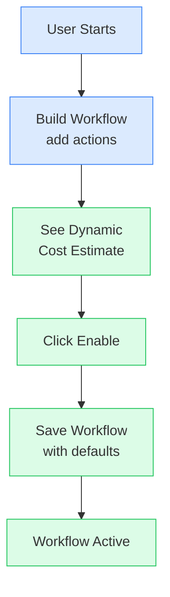
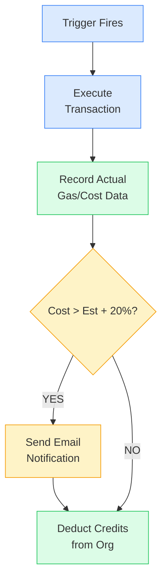
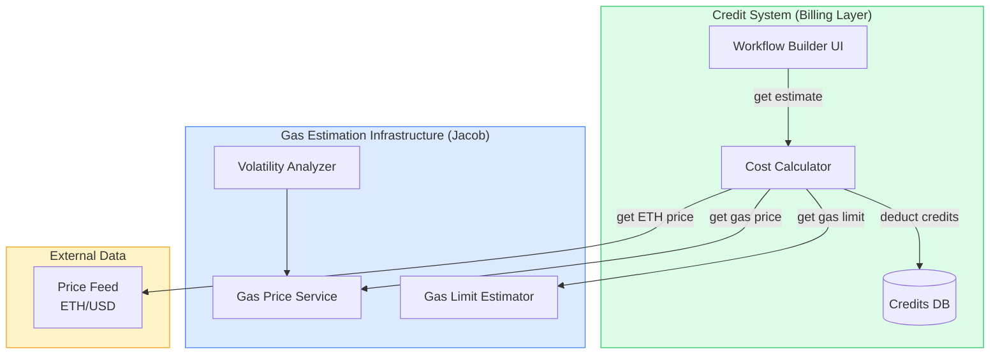
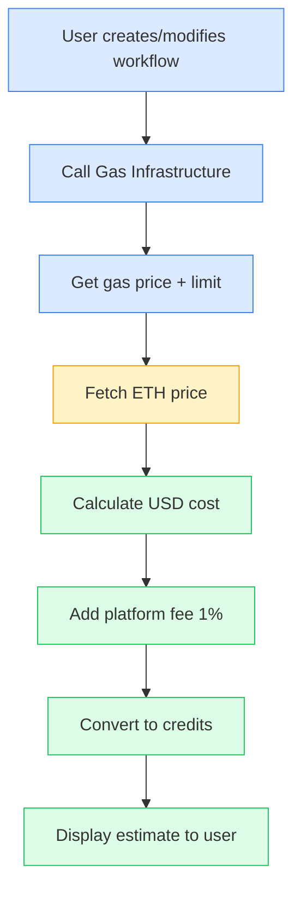

# Gas Estimation & Credit System Concept

**Author:** Sasha
**Date:** 2026-01-29
**Status:** Draft - Awaiting Team Feedback
**Related Discussion:** Team sync call (transcript available)

**Diagrams:** Rendered using Mermaid

---

## Implementation Status

> **This document is a proposal for future work.** The billing/credit system described here does not yet exist in the codebase.

| Component | Status | Notes |
|-----------|--------|-------|
| Gas estimation infrastructure | **Implemented** | `lib/web3/gas-strategy.ts` - production ready |
| Volatility analysis | **Implemented** | 10-block CV calculation (configurable) |
| Chain-specific configs | **Implemented** | Hardcoded + DB overridable |
| Credit/billing tables | **Not implemented** | Schema changes required |
| `PLATFORM_FEE_PERCENT` env var | **Not implemented** | Needs to be added |
| ETH price feed integration | **Not implemented** | Provider TBD (Chainlink, CoinGecko) |
| Cost tracking columns | **Not implemented** | `workflow_executions` schema update needed |
| Org spending settings | **Not implemented** | `organization` schema update needed |

---

## Executive Summary

This document outlines the proposed approach for dynamic gas estimation and credit pricing in KeeperHub. The goal is to provide users with transparent, real-time cost information while protecting both users and the platform from unexpected expenses due to ETH/gas price volatility.

---

## Problem Statement

Currently, we use a simplified model: **1 execution = 1 credit = $0.01**. This is insufficient for production because:

1. **Gas costs vary significantly** - A single poke execution can cost anywhere from $20 to $80+ depending on network conditions
2. **ETH price volatility** - The same gas amount in gwei can translate to vastly different USD values
3. **No user awareness** - Users don't know how much their workflows will actually cost
4. **Platform sustainability** - We need a sustainable revenue model beyond covering gas costs

---

## Proposed Solution

### 1. Dynamic Cost Estimation During Workflow Creation

When a user creates or modifies a workflow, we dynamically calculate and display the estimated credit cost based on:

- **Contract functions being called** (we know from workflow definition)
- **Current gas price** (fetched from network)
- **Current ETH price** (fetched from price feed)
- **Platform fee** (percentage on top)

```
┌─────────────────────────────────────────────────────────────────┐
│                    WORKFLOW BUILDER                              │
├─────────────────────────────────────────────────────────────────┤
│                                                                  │
│  [Trigger: Cron - Every Monday 9:00 AM]                         │
│       ↓                                                          │
│  [Action: Transfer 200 USDC to 0x1234...]                       │
│       ↓                                                          │
│  [Action: Call contract.updatePrice()]                          │
│                                                                  │
├─────────────────────────────────────────────────────────────────┤
│                  ESTIMATED EXECUTION COST                        │
├─────────────────────────────────────────────────────────────────┤
│                                                                  │
│   Gas Estimate:        ~85,000 gas                              │
│   Current Gas Price:   25 gwei                                   │
│   Current ETH Price:   $3,200                                    │
│                                                                  │
│   ─────────────────────────────────────                          │
│   Gas Cost:            $6.80                                     │
│   Platform Fee (1%):   $0.07                                     │
│   ─────────────────────────────────────                          │
│   TOTAL:               ~687 credits ($6.87)                      │
│                                                                  │
│   ⚠️  This is an estimate. Actual cost depends on               │
│       network conditions at execution time.                      │
│                                                                  │
└─────────────────────────────────────────────────────────────────┘
```

### 2. Sensible Defaults - No Required Input

> **Design principle:** Users should be able to create and enable a workflow with minimal friction. All settings have sensible defaults - no checkboxes, acknowledgments, or configuration required during workflow creation.

When enabling a workflow, the user simply sees the cost estimate and clicks "Enable":

```
┌─────────────────────────────────────────────────────────────────┐
│              ENABLE WORKFLOW                                     │
├─────────────────────────────────────────────────────────────────┤
│                                                                  │
│  Workflow: Weekly USDC Transfer                                 │
│  Schedule: Every Monday at 9:00 AM                              │
│                                                                  │
│  ─────────────────────────────────────                          │
│  Estimated cost per execution: ~687 credits ($6.87)             │
│  Estimated monthly cost: ~2,748 credits (~$27.48)               │
│  ─────────────────────────────────────                          │
│                                                                  │
│  ℹ️  Actual cost depends on network conditions at execution     │
│     time. You'll be notified if costs increase significantly.   │
│                                                                  │
│           [Cancel]                    [Enable Workflow]          │
│                                                                  │
└─────────────────────────────────────────────────────────────────┘
```

**Default settings (configured at org level, not per-workflow):**

| Setting | Default Value | Location |
|---------|---------------|----------|
| Cost spike notification threshold | 20% | Org Settings |
| Email notifications enabled | Yes | Org Settings |
| Spending ceiling per workflow | No limit | Org Settings |
| Spending ceiling per org/month | No limit | Org Settings |

Users who want to customize these can do so in **Organization Settings** - not during workflow creation. This reduces friction while still providing control for those who want it.

### 3. Cost Spike Notifications (Optional - Needs Team Confirmation)

When the actual execution cost exceeds the original estimate by a configurable threshold (default: 20%), send a notification:

```
┌─────────────────────────────────────────────────────────────────┐
│  📧 EMAIL NOTIFICATION                                           │
├─────────────────────────────────────────────────────────────────┤
│                                                                  │
│  Subject: [KeeperHub] Gas costs increased for "Weekly Transfer" │
│                                                                  │
│  Hi,                                                             │
│                                                                  │
│  The execution cost for your workflow "Weekly Transfer" has     │
│  increased significantly:                                        │
│                                                                  │
│    Original estimate:  687 credits ($6.87)                      │
│    Latest execution:   892 credits ($8.92)                      │
│    Increase:           +30%                                      │
│                                                                  │
│  This is due to increased ETH/gas prices on the network.        │
│                                                                  │
│  Your workflow will continue to run. If you wish to pause it    │
│  or adjust settings, visit your dashboard:                      │
│                                                                  │
│  [View Workflow Settings]                                        │
│                                                                  │
│  Current credit balance: 5,420 credits                          │
│  Estimated runs remaining: ~6 executions                        │
│                                                                  │
└─────────────────────────────────────────────────────────────────┘
```

**Open Questions:**

- Should we pause the workflow if cost exceeds threshold? (Dumitru suggests NO - users enabled cron, they want it to run)
- What's the right threshold? 20%? 50%? User-configurable?
- Should this be opt-in during workflow creation?

> **Luca's input:** Critical workflows (like poker-keeper for Sky) should NEVER stop due to gas spikes. We should notify but not halt. Users can opt-in to notifications with configurable thresholds.

### 4. Platform Fee Structure

We take a percentage of each execution as platform revenue:

| Component        | Description                                             |
| ---------------- | ------------------------------------------------------- |
| **Gas Cost**     | Actual network gas × ETH price (passed through to user) |
| **Platform Fee** | Configurable percentage of total execution cost         |

**Configuration:**

The platform fee percentage is configurable via environment variable:

```bash
PLATFORM_FEE_PERCENT=1  # Default: 1%
```

This allows adjusting the fee without code changes, enabling:
- Easy A/B testing of different fee levels
- Quick adjustments based on market conditions
- Different fees for different environments (dev/staging/prod)

**Example (with default 1% fee):**

- Gas cost: $6.80 (680 credits)
- Platform fee: $0.07 (7 credits)
- **Total charged: 687 credits**

The platform fee provides:

- Revenue for platform sustainability
- Incentive alignment (we benefit when users run more workflows)
- Simple, transparent pricing

**Note:** 1% may be too low for sustainability. The exact percentage can be discussed and adjusted later via the env var without requiring code changes.

### 5. Execution History & Cost Transparency

Users can view a detailed breakdown of all executions and their costs:

```
┌─────────────────────────────────────────────────────────────────────────────────┐
│                         EXECUTION HISTORY                                        │
├─────────────────────────────────────────────────────────────────────────────────┤
│  Workflow: Weekly USDC Transfer                                                  │
│  Period: Last 30 days                                                            │
├─────────────────────────────────────────────────────────────────────────────────┤
│                                                                                  │
│  SUMMARY                                                                         │
│  ────────────────────────────────────────────────────────                        │
│  Total Executions:     4                                                         │
│  Total Gas Cost:       $26.40 (2,640 credits)                                   │
│  Total Platform Fee:   $0.27 (27 credits)                                       │
│  Total Spent:          $26.67 (2,667 credits)                                   │
│  Avg Cost/Execution:   $6.67 (667 credits)                                      │
│                                                                                  │
├──────────────┬──────────────┬───────────┬───────────┬───────────┬───────────────┤
│ Date         │ Status       │ Gas Used  │ Gas Price │ ETH Price │ Total Cost    │
├──────────────┼──────────────┼───────────┼───────────┼───────────┼───────────────┤
│ Jan 27, 9:00 │ ✅ Success   │ 84,521    │ 28 gwei   │ $3,180    │ 752 credits   │
│ Jan 20, 9:00 │ ✅ Success   │ 85,102    │ 22 gwei   │ $3,220    │ 603 credits   │
│ Jan 13, 9:00 │ ✅ Success   │ 84,890    │ 25 gwei   │ $3,150    │ 668 credits   │
│ Jan 6, 9:00  │ ✅ Success   │ 85,230    │ 24 gwei   │ $3,200    │ 654 credits   │
└──────────────┴──────────────┴───────────┴───────────┴───────────┴───────────────┘

                    [Export CSV]        [View All Executions]
```

---

## Technical Implementation Notes

### Gas Estimation

We can leverage existing Web3 libraries for gas estimation:

```typescript
// Using the contract and function, we can estimate gas
const gasEstimate = await contract.estimateGas.transfer(recipient, amount);

// Get current gas price from network
const gasPrice = await provider.getGasPrice();

// Get ETH price from price feed (we already have this for Poker)
const ethPrice = await priceFeed.getLatestPrice();

// Calculate cost in USD
const costInWei = gasEstimate.mul(gasPrice);
const costInEth = ethers.utils.formatEther(costInWei);
const costInUsd = parseFloat(costInEth) * ethPrice;

// Add platform fee
const platformFee = costInUsd * 0.01;
const totalCost = costInUsd + platformFee;

// Convert to credits (1 credit = $0.01)
const creditsRequired = Math.ceil(totalCost * 100);
```

### Database Schema Additions

We'll need to track:

```sql
-- Add to workflow_executions table
ALTER TABLE workflow_executions ADD COLUMN gas_used BIGINT;
ALTER TABLE workflow_executions ADD COLUMN gas_price_gwei DECIMAL(20, 9);
ALTER TABLE workflow_executions ADD COLUMN eth_price_usd DECIMAL(20, 8);
ALTER TABLE workflow_executions ADD COLUMN gas_cost_credits INTEGER;
ALTER TABLE workflow_executions ADD COLUMN platform_fee_credits INTEGER;
ALTER TABLE workflow_executions ADD COLUMN total_credits_charged INTEGER;

-- Store original estimate for comparison
ALTER TABLE workflows ADD COLUMN estimated_credits_per_execution INTEGER;

-- Org-level settings (defaults for all workflows in org)
ALTER TABLE organizations ADD COLUMN cost_notification_threshold DECIMAL(5, 2) DEFAULT 0.20;
ALTER TABLE organizations ADD COLUMN cost_notifications_enabled BOOLEAN DEFAULT TRUE;
ALTER TABLE organizations ADD COLUMN spending_ceiling_per_workflow INTEGER DEFAULT NULL;
ALTER TABLE organizations ADD COLUMN spending_ceiling_per_month INTEGER DEFAULT NULL;
```

---

## User Flow Diagrams

### Flow 1: Creating a New Workflow (Simplified - No Required Input)



> **Note:** No acknowledgment checkbox or configuration required. All settings use org-level defaults.

### Flow 2: Execution & Cost Tracking



---

## Integration with Gas Estimation Infrastructure

> **Jacob's feedback:** _"The infrastructure for dynamic estimation exists. The billing layer wraps it."_

The Credit System (billing layer) does **NOT** plan to implement its own gas price caching or volatility analysis. Instead, it will consume data from Jacob's existing gas estimation infrastructure, which already handles:

- 10-block volatility analysis (CV calculation, configurable via `volatilitySampleBlocks`)
- Trigger-based gas price strategy (event/webhook = conservative, scheduled = volatility-based)
- Gas limit multipliers (L1 vs L2)
- Retry escalation (1.5x factor, up to 2.25x)

### Architecture: Billing Layer Wraps Gas Infrastructure



### What the Billing Layer Needs from Gas Infrastructure

| Data Required | Source | Used For |
|---------------|--------|----------|
| Gas price (gwei) | Jacob's infra | USD cost calculation |
| Gas limit estimate | Jacob's infra | USD cost calculation |
| Volatility indicator | Jacob's infra | UI warning (high/low volatility) |
| ETH price (USD) | Price feed (TBD) | USD cost calculation |

### What the Billing Layer Computes

| Computation | Formula |
|-------------|---------|
| Gas cost (USD) | `gasLimit × gasPrice × ethPrice` |
| Platform fee (USD) | `gasCost × 0.01` (1%) |
| Total cost (USD) | `gasCost + platformFee` |
| Credits required | `Math.ceil(totalCost × 100)` |

### Billing Layer Flow



---

## Open Questions for Team Discussion

1. **Platform Fee Percentage**
   - ~~Is 1% appropriate? Should it be higher for sustainability?~~ → **Resolved:** Fee is configurable via `PLATFORM_FEE_PERCENT` env var. Can be adjusted without code changes.
   - Should we have volume discounts? (Future consideration)

2. **Cost Spike Notifications**
   - What threshold triggers a notification? (20% suggested)
   - Should it be user-configurable?
   - Should we EVER pause workflows due to cost? (Consensus seems to be NO)

3. **Gas Infrastructure Integration (Question for Jacob)**

   > Reference: _"The infrastructure for dynamic estimation exists. The billing layer wraps it."_

   **@Jacob:** The Credit System needs to consume gas estimation data from your infrastructure. Please document how the billing layer should access this data:

   - **Access method:** Internal API? Redis keys? Direct function import?
   - **Available data:** What exactly is exposed? (gas price, gas limit, volatility CV, percentile?)
   - **Data format:** TypeScript interface / response schema?
   - **Refresh rate:** How often is the data updated?
   - **Example usage:** Code snippet showing how to call your infrastructure?

   Please add your response below or in a separate section of this document.

   ---

   **Jacob's Response:**

   ### Access Method

   **Direct function import** from the `lib/web3` module:

   ```typescript
   import {
     getGasStrategy,
     type GasConfig,
     type VolatilityMetrics
   } from "@/lib/web3";
   ```

   The gas strategy uses a **singleton pattern**—`getGasStrategy()` returns the shared instance. No Redis, no API calls between services. The billing layer imports and calls directly.

   ### Available Data

   | Data | Method | Returns | Status |
   |------|--------|---------|--------|
   | Gas config (limit + fees) | `gasStrategy.getGasConfig(provider, triggerType, estimatedGas, chainId)` | `GasConfig` | Public |
   | Volatility metrics | `gasStrategy.measureVolatility(provider, sampleBlocks?)` | `VolatilityMetrics` | **Private** |
   | Chain-specific config | `gasStrategy.getChainConfig(chainId)` | `GasStrategyConfig` | **Private** |

   > **Action Required:** `measureVolatility()` and `getChainConfig()` are currently private methods in `AdaptiveGasStrategy`. For the billing layer to access volatility data for UI warnings, these methods need to be made publicly accessible. This is a small change to `lib/web3/gas-strategy.ts`.

   **Note:** ETH/USD price is **not** provided by gas infrastructure. The billing layer must fetch this separately (Chainlink price feed, CoinGecko API, etc.).

   ### Data Format (TypeScript Interfaces)

   ```typescript
   // What you get from getGasConfig()
   type GasConfig = {
     gasLimit: bigint;
     maxFeePerGas: bigint;
     maxPriorityFeePerGas: bigint;
   };

   // What you get from measureVolatility()
   type VolatilityMetrics = {
     baseFees: bigint[];              // Recent base fees from blocks
     mean: bigint;                    // Mean base fee
     stdDev: bigint;                  // Standard deviation
     coefficientOfVariation: number;  // CV = stdDev / mean (0.0 - 1.0+)
     isVolatile: boolean;             // true if CV >= 0.3
   };

   // Trigger types affect gas strategy
   type TriggerType = "event" | "webhook" | "scheduled" | "manual";
   ```

   ### Refresh Rate

   **No caching**—fees are calculated fresh on each call via `eth_feeHistory` RPC. This is intentional: gas prices can change block-to-block, and stale data leads to failed transactions.

   For the billing layer's **UI estimates**, you may want to add your own short-lived cache (e.g., 15-30 seconds) to avoid hammering the RPC on every keystroke in the workflow builder.

   ### Example Usage

   ```typescript
   import { getGasStrategy } from "@/lib/web3";
   import { ethers } from "ethers";

   async function estimateCreditCost(
     provider: ethers.JsonRpcProvider,
     contract: ethers.Contract,
     method: string,
     args: unknown[],
     triggerType: TriggerType,
     chainId: number,
     ethPriceUsd: number,        // Billing layer fetches this
     platformFeePercent: number  // From env var
   ): Promise<{
     gasLimit: bigint;
     gasPriceGwei: number;
     gasCostUsd: number;
     platformFeeUsd: number;
     totalCredits: number;
     volatility: VolatilityMetrics;
   }> {
     const gasStrategy = getGasStrategy();

     // 1. Estimate gas for the specific contract call
     const estimatedGas = await contract[method].estimateGas(...args);

     // 2. Get gas config (limit + fees) from infrastructure
     const gasConfig = await gasStrategy.getGasConfig(
       provider,
       triggerType,
       estimatedGas,
       chainId
     );

     // 3. Get volatility for UI warning
     // NOTE: measureVolatility() is currently private - needs to be made public first
     const volatility = await gasStrategy.measureVolatility(provider);

     // 4. Calculate USD cost (billing layer logic)
     const gasPriceGwei = Number(gasConfig.maxFeePerGas) / 1e9;
     const gasInEth = Number(gasConfig.gasLimit * gasConfig.maxFeePerGas) / 1e18;
     const gasCostUsd = gasInEth * ethPriceUsd;

     // 5. Add platform fee
     const platformFeeUsd = gasCostUsd * (platformFeePercent / 100);
     const totalUsd = gasCostUsd + platformFeeUsd;

     // 6. Convert to credits (1 credit = $0.01)
     const totalCredits = Math.ceil(totalUsd * 100);

     return {
       gasLimit: gasConfig.gasLimit,
       gasPriceGwei,
       gasCostUsd,
       platformFeeUsd,
       totalCredits,
       volatility,
     };
   }
   ```

   ### Important Notes for Billing Layer

   1. **Gas limit multipliers are already applied** by `getGasConfig()`. Don't double-multiply.

   2. **Trigger type matters:**
      - `event`/`webhook` → Always conservative (higher fees, faster inclusion)
      - `scheduled`/`manual` → Volatility-based optimization (can be cheaper)

   3. **Chain-specific behavior:** L2s (Arbitrum, Base) use lower multipliers (1.5x vs 2.0x) because their gas estimates are more accurate.

   4. **The estimate is a ceiling, not exact cost.** Actual execution typically uses less gas than `gasLimit`. For historical cost tracking, use `receipt.gasUsed * receipt.effectiveGasPrice`.

   5. **Volatility UI hint:** If `volatility.isVolatile === true` (CV >= 0.3), show a warning in the UI that costs may vary significantly.

   ### What's NOT Provided

   | Data | Reason | Billing Layer Must |
   |------|--------|-------------------|
   | ETH/USD price | Out of scope for gas infra | Fetch from price feed |
   | Historical gas prices | No caching | Query execution records from DB |
   | Cost in USD/credits | Business logic | Calculate using formula above |

   ### Source Files

   - `keeperhub/lib/web3/gas-strategy.ts` — Core implementation (663 lines)
   - `keeperhub/lib/web3/transaction-manager.ts` — Transaction execution wrapper
   - `tests/unit/gas-strategy.test.ts` — Unit tests (632 lines)
   - `tests/e2e/gas-strategy.test.ts` — Live network tests (443 lines)

   ---

4. **Email Notifications**
   - Do we have email infrastructure ready?
   - What other notification channels? (Discord, in-app, webhook)

5. **Historical Data**
   - How far back should we show execution history?
   - What level of granularity in cost breakdown?

---

**Key points by person:**

**Dumitru:**

- Users who enable cron keepers don't care about gas fluctuations - they want it to run
- We should provide all possible information upfront (table with scenarios)
- Users need to explicitly acknowledge understanding before enabling
- Need transparent reporting: "Last month Poker keeper did 300 executions, cost $500"

**Arty:**

- UX should follow MetaMask pattern: show gas estimate + platform fee clearly
- Ask for user input (frequency, etc.) then show calculated estimate
- Avoid overwhelming tables - provide info based on user input

**Luca:**

- Some users might create many keepers without realizing costs
- Need notification system for gas spikes (not to stop, but to inform)
- Educate users about their spending (weekly/monthly summaries)
- Could be "intelligent gas estimation" interim solution
- Transparency is key - we're not trying to hide anything

**Joel:**

- Concerns about displaying raw org names (could be inappropriate)
- Internal dashboards for monitoring usage

**Jacob:**

- The infrastructure for dynamic gas estimation already exists
- 40-block volatility analysis for fee selection (CV-based percentile)
- Trigger-based strategy: event/webhook = always conservative, scheduled = volatility-based
- Gas limit multipliers for L1 vs L2 networks
- Retry escalation with 1.5x factor (up to 2.25x)
- The billing layer should wrap existing infrastructure, not duplicate it

**Team Feedback (2026-01-30):**

- 1% platform fee sounds quite low, but can be discussed and adjusted later → **Resolved:** Make configurable via `PLATFORM_FEE_PERCENT` env var
- Should have sound defaults for all options (notification preferences, acknowledgements, spending ceilings) - no input from user required when creating a workflow besides enabling it → **Resolved:** Settings moved to org-level defaults, workflow creation simplified

---

_This document is a draft for team discussion. Please provide feedback in the comments or during our next sync._
