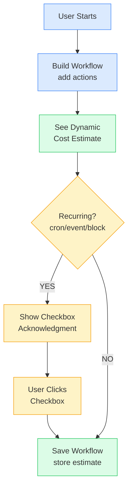
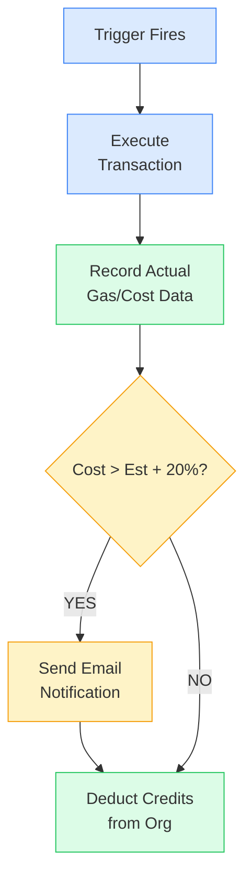

# Gas Estimation & Credit System Concept

**Author:** Sasha
**Date:** 2026-01-29
**Status:** Draft - Awaiting Team Feedback
**Related Discussion:** Team sync call (transcript available)

**Diagrams:** Rendered using Mermaid

---

## Executive Summary

This document outlines the proposed approach for dynamic gas estimation and credit pricing in KeeperHub. The goal is to provide users with transparent, real-time cost information while protecting both users and the platform from unexpected expenses due to ETH/gas price volatility.

---

## Problem Statement

Currently, we use a simplified model: **1 execution = 1 credit = $0.01**. This is insufficient for production because:

1. **Gas costs vary significantly** - A single poke execution can cost anywhere from $20 to $80+ depending on network conditions
2. **ETH price volatility** - The same gas amount in gwei can translate to vastly different USD values
3. **No user awareness** - Users don't know how much their workflows will actually cost
4. **Platform sustainability** - We need a sustainable revenue model beyond covering gas costs

---

## Proposed Solution

### 1. Dynamic Cost Estimation During Workflow Creation

When a user creates or modifies a workflow, we dynamically calculate and display the estimated credit cost based on:

- **Contract functions being called** (we know from workflow definition)
- **Current gas price** (fetched from network)
- **Current ETH price** (fetched from price feed)
- **Platform fee** (percentage on top)

```
┌─────────────────────────────────────────────────────────────────┐
│                    WORKFLOW BUILDER                              │
├─────────────────────────────────────────────────────────────────┤
│                                                                  │
│  [Trigger: Cron - Every Monday 9:00 AM]                         │
│       ↓                                                          │
│  [Action: Transfer 200 USDC to 0x1234...]                       │
│       ↓                                                          │
│  [Action: Call contract.updatePrice()]                          │
│                                                                  │
├─────────────────────────────────────────────────────────────────┤
│                  ESTIMATED EXECUTION COST                        │
├─────────────────────────────────────────────────────────────────┤
│                                                                  │
│   Gas Estimate:        ~85,000 gas                              │
│   Current Gas Price:   25 gwei                                   │
│   Current ETH Price:   $3,200                                    │
│                                                                  │
│   ─────────────────────────────────────                          │
│   Gas Cost:            $6.80                                     │
│   Platform Fee (1%):   $0.07                                     │
│   ─────────────────────────────────────                          │
│   TOTAL:               ~687 credits ($6.87)                      │
│                                                                  │
│   ⚠️  This is an estimate. Actual cost depends on               │
│       network conditions at execution time.                      │
│                                                                  │
└─────────────────────────────────────────────────────────────────┘
```

### 2. Explicit User Acknowledgment for Recurring Workflows

For workflows with recurring triggers (cron, event-based, block-based), users MUST acknowledge price volatility before enabling:

```
┌─────────────────────────────────────────────────────────────────┐
│              ENABLE RECURRING WORKFLOW                           │
├─────────────────────────────────────────────────────────────────┤
│                                                                  │
│  You are about to enable a workflow that runs automatically.    │
│                                                                  │
│  Estimated cost per execution: ~687 credits ($6.87)          │
│  Schedule: Every Monday at 9:00 AM                           │
│  Estimated monthly cost: ~2,748 credits (~$27.48)            │
│                                                                  │
│  ┌────────────────────────────────────────────────────────────┐ │
│  │ ☑️  I understand that:                                      │ │
│  │                                                              │ │
│  │    • The credit cost is NOT fixed and depends on ETH       │ │
│  │      price and network gas prices at execution time        │ │
│  │                                                              │ │
│  │    • If ETH or gas prices increase significantly, my       │ │
│  │      executions will cost more credits                     │ │
│  │                                                              │ │
│  │    • I am responsible for maintaining sufficient credit    │ │
│  │      balance in my organization wallet                     │ │
│  └────────────────────────────────────────────────────────────┘ │
│                                                                  │
│           [Cancel]                    [Enable Workflow]          │
│                                                                  │
└─────────────────────────────────────────────────────────────────┘
```

### 3. Cost Spike Notifications (Optional - Needs Team Confirmation)

When the actual execution cost exceeds the original estimate by a configurable threshold (default: 20%), send a notification:

```
┌─────────────────────────────────────────────────────────────────┐
│  📧 EMAIL NOTIFICATION                                           │
├─────────────────────────────────────────────────────────────────┤
│                                                                  │
│  Subject: [KeeperHub] Gas costs increased for "Weekly Transfer" │
│                                                                  │
│  Hi,                                                             │
│                                                                  │
│  The execution cost for your workflow "Weekly Transfer" has     │
│  increased significantly:                                        │
│                                                                  │
│    Original estimate:  687 credits ($6.87)                      │
│    Latest execution:   892 credits ($8.92)                      │
│    Increase:           +30%                                      │
│                                                                  │
│  This is due to increased ETH/gas prices on the network.        │
│                                                                  │
│  Your workflow will continue to run. If you wish to pause it    │
│  or adjust settings, visit your dashboard:                      │
│                                                                  │
│  [View Workflow Settings]                                        │
│                                                                  │
│  Current credit balance: 5,420 credits                          │
│  Estimated runs remaining: ~6 executions                        │
│                                                                  │
└─────────────────────────────────────────────────────────────────┘
```

**Open Questions:**

- Should we pause the workflow if cost exceeds threshold? (Dumitru suggests NO - users enabled cron, they want it to run)
- What's the right threshold? 20%? 50%? User-configurable?
- Should this be opt-in during workflow creation?

> **Luca's input:** Critical workflows (like poker-keeper for Sky) should NEVER stop due to gas spikes. We should notify but not halt. Users can opt-in to notifications with configurable thresholds.

### 4. Platform Fee Structure

We take a percentage of each execution as platform revenue:

| Component        | Description                                             |
| ---------------- | ------------------------------------------------------- |
| **Gas Cost**     | Actual network gas × ETH price (passed through to user) |
| **Platform Fee** | 1% of total execution cost                              |

**Example:**

- Gas cost: $6.80 (680 credits)
- Platform fee: $0.07 (7 credits)
- **Total charged: 687 credits**

The 1% fee provides:

- Revenue for platform sustainability
- Incentive alignment (we benefit when users run more workflows)
- Simple, transparent pricing

**Open Questions:**

- Is 1% the right percentage? Too low? Too high?
- Should we have tiered pricing for high-volume users?
- Should the fee be a flat rate per execution instead?

### 5. Execution History & Cost Transparency

Users can view a detailed breakdown of all executions and their costs:

```
┌─────────────────────────────────────────────────────────────────────────────────┐
│                         EXECUTION HISTORY                                        │
├─────────────────────────────────────────────────────────────────────────────────┤
│  Workflow: Weekly USDC Transfer                                                  │
│  Period: Last 30 days                                                            │
├─────────────────────────────────────────────────────────────────────────────────┤
│                                                                                  │
│  SUMMARY                                                                         │
│  ────────────────────────────────────────────────────────                        │
│  Total Executions:     4                                                         │
│  Total Gas Cost:       $26.40 (2,640 credits)                                   │
│  Total Platform Fee:   $0.27 (27 credits)                                       │
│  Total Spent:          $26.67 (2,667 credits)                                   │
│  Avg Cost/Execution:   $6.67 (667 credits)                                      │
│                                                                                  │
├──────────────┬──────────────┬───────────┬───────────┬───────────┬───────────────┤
│ Date         │ Status       │ Gas Used  │ Gas Price │ ETH Price │ Total Cost    │
├──────────────┼──────────────┼───────────┼───────────┼───────────┼───────────────┤
│ Jan 27, 9:00 │ ✅ Success   │ 84,521    │ 28 gwei   │ $3,180    │ 752 credits   │
│ Jan 20, 9:00 │ ✅ Success   │ 85,102    │ 22 gwei   │ $3,220    │ 603 credits   │
│ Jan 13, 9:00 │ ✅ Success   │ 84,890    │ 25 gwei   │ $3,150    │ 668 credits   │
│ Jan 6, 9:00  │ ✅ Success   │ 85,230    │ 24 gwei   │ $3,200    │ 654 credits   │
└──────────────┴──────────────┴───────────┴───────────┴───────────┴───────────────┘

                    [Export CSV]        [View All Executions]
```

---

## Technical Implementation Notes

### Gas Estimation

We can leverage existing Web3 libraries for gas estimation:

```typescript
// Using the contract and function, we can estimate gas
const gasEstimate = await contract.estimateGas.transfer(recipient, amount);

// Get current gas price from network
const gasPrice = await provider.getGasPrice();

// Get ETH price from price feed (we already have this for Poker)
const ethPrice = await priceFeed.getLatestPrice();

// Calculate cost in USD
const costInWei = gasEstimate.mul(gasPrice);
const costInEth = ethers.utils.formatEther(costInWei);
const costInUsd = parseFloat(costInEth) * ethPrice;

// Add platform fee
const platformFee = costInUsd * 0.01;
const totalCost = costInUsd + platformFee;

// Convert to credits (1 credit = $0.01)
const creditsRequired = Math.ceil(totalCost * 100);
```

### Database Schema Additions

We'll need to track:

```sql
-- Add to workflow_executions table
ALTER TABLE workflow_executions ADD COLUMN gas_used BIGINT;
ALTER TABLE workflow_executions ADD COLUMN gas_price_gwei DECIMAL(20, 9);
ALTER TABLE workflow_executions ADD COLUMN eth_price_usd DECIMAL(20, 8);
ALTER TABLE workflow_executions ADD COLUMN gas_cost_credits INTEGER;
ALTER TABLE workflow_executions ADD COLUMN platform_fee_credits INTEGER;
ALTER TABLE workflow_executions ADD COLUMN total_credits_charged INTEGER;

-- Store original estimate for comparison
ALTER TABLE workflows ADD COLUMN estimated_credits_per_execution INTEGER;
ALTER TABLE workflows ADD COLUMN cost_acknowledgment_accepted BOOLEAN DEFAULT FALSE;
ALTER TABLE workflows ADD COLUMN cost_notification_threshold DECIMAL(5, 2) DEFAULT 0.20;
```

---

## User Flow Diagrams

### Flow 1: Creating a New Workflow

```
┌─────────────┐     ┌─────────────────┐     ┌──────────────────┐
│   User      │     │  Build Workflow │     │  See Dynamic     │
│   Starts    │────▶│  (add actions)  │────▶│  Cost Estimate   │
└─────────────┘     └─────────────────┘     └────────┬─────────┘
                                                     │
                    ┌─────────────────────────────────┘
                    ▼
        ┌───────────────────────┐
        │  Is it recurring?     │
        │  (cron/event/block)   │
        └───────────┬───────────┘
                    │
           ┌────────┴────────┐
           ▼                 ▼
        ┌──────┐          ┌──────┐
        │ YES  │          │  NO  │
        └──┬───┘          └──┬───┘
           │                 │
           ▼                 │
    ┌──────────────┐         │
    │ Show checkbox │        │
    │ for price     │        │
    │ acknowledgment│        │
    └──────┬───────┘         │
           │                 │
           ▼                 │
    ┌──────────────┐         │
    │ User clicks  │         │
    │ checkbox     │         │
    └──────┬───────┘         │
           │                 │
           └────────┬────────┘
                    ▼
           ┌───────────────┐
           │ Save Workflow │
           │ (store est.)  │
           └───────────────┘
```



### Flow 2: Execution & Cost Tracking

```
┌─────────────┐     ┌─────────────────┐     ┌──────────────────┐
│  Trigger    │     │  Execute        │     │  Record Actual   │
│  Fires      │────▶│  Transaction    │────▶│  Gas/Cost Data   │
└─────────────┘     └─────────────────┘     └────────┬─────────┘
                                                     │
                                                     ▼
                                            ┌───────────────────┐
                                            │  Cost > Est + 20%?│
                                            └─────────┬─────────┘
                                                      │
                                             ┌────────┴────────┐
                                             ▼                 ▼
                                          ┌──────┐          ┌──────┐
                                          │ YES  │          │  NO  │
                                          └──┬───┘          └──┬───┘
                                             │                 │
                                             ▼                 │
                                      ┌──────────────┐         │
                                      │ Send Email   │         │
                                      │ Notification │         │
                                      └──────┬───────┘         │
                                             │                 │
                                             └────────┬────────┘
                                                      ▼
                                             ┌───────────────┐
                                             │ Deduct Credits│
                                             │ from Org      │
                                             └───────────────┘
```



---

## Open Questions for Team Discussion

1. **Platform Fee Percentage**
   - Is 1% appropriate? Should it be higher for sustainability?
   - Should we have volume discounts?

2. **Cost Spike Notifications**
   - What threshold triggers a notification? (20% suggested)
   - Should it be user-configurable?
   - Should we EVER pause workflows due to cost? (Consensus seems to be NO)

3. **Gas Estimation Timing**
   - Should Jacob's gas estimation work align with this credit system?
   - Need to confirm current state and avoid duplicate work

4. **Email Notifications**
   - Do we have email infrastructure ready?
   - What other notification channels? (Discord, in-app, webhook)

5. **Historical Data**
   - How far back should we show execution history?
   - What level of granularity in cost breakdown?

---

**Key points by person:**

**Dumitru:**

- Users who enable cron keepers don't care about gas fluctuations - they want it to run
- We should provide all possible information upfront (table with scenarios)
- Users need to explicitly acknowledge understanding before enabling
- Need transparent reporting: "Last month Poker keeper did 300 executions, cost $500"

**Arty:**

- UX should follow MetaMask pattern: show gas estimate + platform fee clearly
- Ask for user input (frequency, etc.) then show calculated estimate
- Avoid overwhelming tables - provide info based on user input

**Luca:**

- Some users might create many keepers without realizing costs
- Need notification system for gas spikes (not to stop, but to inform)
- Educate users about their spending (weekly/monthly summaries)
- Could be "intelligent gas estimation" interim solution
- Transparency is key - we're not trying to hide anything

**Joel:**

- Concerns about displaying raw org names (could be inappropriate)
- Internal dashboards for monitoring usage

---

_This document is a draft for team discussion. Please provide feedback in the comments or during our next sync._
